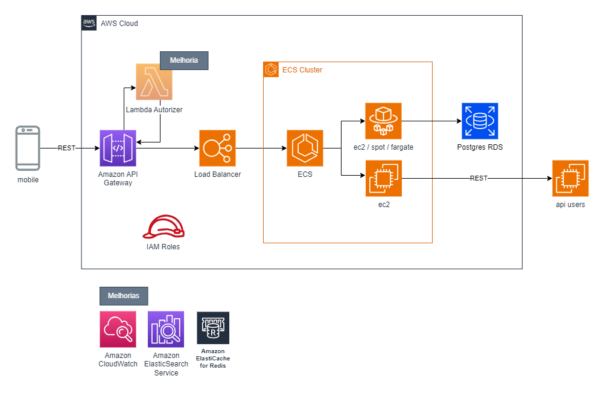
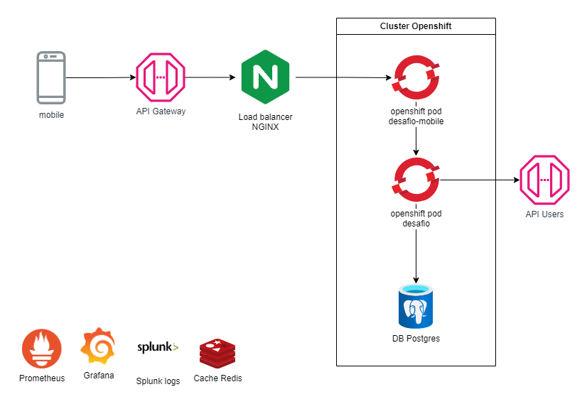

# Desafio Cooperativa

## Descrição

Este projeto foi concebido para avaliação técnica e validação de novas tecnologias.

## Funcionalidades

### Regras de negócio

- [x] Criação de pautas
- [x] Criação de sessões em pautas
    - [x] Validação se a pauta existe
    - [x] Validação se já existe alguma sessão em andamento
- [x] Votação dos associados em uma pauta
    - [x] Validação se pauta existe
    - [x] Validação se já existe alguma sessão em andamento
    - [x] Validação se o CPF é valido em um serviço externo (desafio-mock)
    - [x] Validação se o CPF está permitido para a votação
    - [x] Validação se o CPF já votou nessa pauta
- [x] Consolidação dos votos de uma pauta

### Montagem de telas para mobile

- [x] montar tela - inicial
- [x] montar tela - listar pautas
- [x] montar tela - cadastrar pauta
- [x] montar tela - cadastrar sessão
- [x] montar tela - cadastrar voto

### Tarefas

- [X] Integração com serviço externo
- [X] Tratamento de erros
- [X] Documentação API
- [x] Versionamento da API com Swagger
- [x] Testes unitários
- [x] Testes automatizados (AutomatizadoTest)
- [ ] Testes de performance (JMeter)
- [x] Collections Postman
- [x] Desenho de solução em nuvem aws (IaaS)
- [x] Desenho de solução em openshift (PaaS)

## Stack

- Java 22
- Spring Boot 3.3.0
- Banco de dados Postgres
- Testes com JUnit, Mockito
- Documentação da API com Swagger/OpenApi
- Lombok
- Docker-compose

## Documentação

A documentação da API está disponível através do Swagger UI, acessível em `/api/swagger-ui/index.html` após iniciar a aplicação.

## Solução

### Solução de arquitetura em AWS

### Solução de arquitetura com openshift (PaaS)

